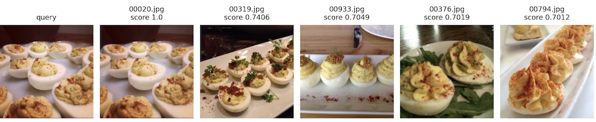

# Image Search Engine

## Objective

Implement a system to search similar images using the embedded image vector consine similarity.

Used Tensorflow Keras **ResNet50** ```avg_pool``` layer output before the fully connected layer as the model 
to transform the images in shape ```(height=224, width=224, channels=3)``` into the embedded image vectors 
of ```2048``` dimensions.

```
img2vec: Model = keras.Model(
    inputs=ResNet50.input,
    outputs=ResNet50.get_layer("avg_pool").output
)
```

## Function

| Input                                                                                                                  | Output                                                                                                  |
|------------------------------------------------------------------------------------------------------------------------|---------------------------------------------------------------------------------------------------------|
| An query image to search similar ones. The image needs to have RGB channels and is in the format that OpenCV can load. | N number of similar images with their names and similarity scores, where the query image is on the left |

**Example**



---
# Terminologies
* FE: Feature Engineering
* npy: numpy serialised file


| Constant            | Description                                                                                                                                                                                                                                     |
|---------------------|-------------------------------------------------------------------------------------------------------------------------------------------------------------------------------------------------------------------------------------------------|
| NPY_IMAGE_VECTORS   | Embedded image vectors each of which represents a resized RGB image in the multidimensional latent space. The dimension size depends onthe vectorizer model, e.g. ResNet50 avg_pool layer output has 2048. Serialized with numpy.save() method. |
| NPY_RESIZED_RGB     | Images resized and transformed to have RGB channel order in memory. Serialized with numpy.save() method.  Each row in the array matches with the image name in NPY_IMAGE_NAMES.                                                                 |
| NPY_IMAGE_NAMES     | Names of the resized RGB images. Each row in the array matches with the image in NPY_RESIZED_RGB. Serialized with numpy.save().                                                                                                                 |
| TF_VECTORIZER_MODEL | Vectorizer Keras Model instance used at modelling to vectorize the images into embedded image vectors.  Serialized with the Keras Model.save() method with the default options.                                                                 |

---
# Note

## Image Data Format
Note the saved images have the channel order as RGB. The in-memory BGR order by OpenCV default
has been converted to RGB and saved with the order in disk.

image in memory passed to a most_similar() as argument MUST be BGR order as with OpenCV imread result, 
because the same transformation (resize, BGR to RGB, Keras/ResNet preprocess) is applied.

## Training/Serving Skew
To prevent training/serving skew (drifts), need to use th same artifacts
fitted to data for transformations (e.g. scaling, mean-centering, PCA), and the consistent 
serialisation and de-serialisation methods.

The numeric data has been serialised using numpy ```save()``` and the Tensorflow Keras model artifacts have been 
serialised using Keras ```Model.save()``` with the default format and options.


---
# System Requirements

1. Python 3.9.x
2. pip 22.3.x
3. OpenCV 4.7
4. Tensorflow 2.10.0
5. Tensorflow Keras Resnet50

### Development Environment
The environment used to develop and test.

```
$python --version
Python 3.9.13

$ pip --version
pip 22.3.1

$ pylint --version
pylint 2.15.6

$ pytest --version
pytest 7.2.0

>>> import cv2
>>> cv2.__version__
'4.7.0'

>>>import tensorflow as tf
>>>print(tf.__version__)
2.10.0
```

---
# Structure

## Directory
Code is organized in the directory:

```
BASE
├── README.md
├── data
│   ├── master                            <--- Original image data                   
│   ├── landing                           <--- ETL output
│   │   ├── image_names.npy               <--- NPY_IMAGE_NAMES
│   │   └── resized_rgb.npy               <--- NPY_RESIZED_RGB
│   ├── feature_store                     <--- Feature engineering output
│   │   └── feature_engineered.npy
│   └── model                             <--- Modelling output
│       ├── embedded_image_vectors.npy    <--- NPY_IMAGE_VECTORS
│       └── vectorizer_model              <--- TF_VECTORIZER_MODEL
├── lib
│   ├── util_constant.py                  <--- Common constant
│   ├── util_file.py                      <--- Python file utility
│   ├── util_numpy.py                     <--- Numpy utility
│   ├── util_opencv
│   │   └── image.py                      <--- OpenCV utility
│   └── util_tf
│       └── resnet50.py                   <--- TF/Keras Resnet utility
└── src
    ├── requiments.txt
    ├── pylintrc
    ├── etl.py                            <--- Resize image and convert to RGB
    ├── feature_engineering.py            <--- Feature engineering e.g. ResNet preprocessing
    ├── model.py                          <--- Vectorizer model and image vector generation
    ├── serve.py                          <--- Image search
    ├── function.py                       <--- Utility
    ├── _common.sh
    ├── run_modelling_pipeline.sh         <--- Run modeling pipeline
    └── run_serving_pipeline.sh           <--- Run image serach

```

## Code

Commonly used functions are placed under ```lib``` directory for reusability not to to repeat the same efforts.

### src/serving.py

#### ```ImageSearchEngine.most_similar```

The method in the class implements the image search based on the cosine similarities.

```
    def most_similar(
            self, query: np.ndarray, n: int = 5  # pylint: disable=invalid-name
    ) -> List[Tuple[float, str]]:
        """
        Return top n most similar images.
```

### src/model.py

#### ```Vectorizer.transform()``` 

The method in the class implements the image vectorization using the ResNet50 ```avg_pool``` layer output
to embed the images into a vector of the latent space of 2048 dimensions.

```
def transform(self, images: Sequence[np.ndarray]) -> Optional[np.ndarray]:
        """Transform list of images into numpy vectors of image features.
        Images should be preprocessed first (padding, resize, normalize,..).

        The results are embedded vectors each of which represents an image
        in a multidimensional space where proximity represents the similarity
        of the images.
```

### lib/util_numpy.py

#### ```get_cosine_similarity()```

The method implements the cosine similarity in the vectorized manner.

```
def get_cosine_similarity(x: numpy.ndarray, y: np.ndarray) -> np.ndarray:
    """Calculate cosine similarity
```

### lib/util_tf/resnet.py

#### ```ResNet50Helper```

The class implements the TF/Keras ResNet50 utility functions.

```
class ResNet50Helper:
    """TF Keras ResNet50 helper function implementations"""
```

### lib/util_opencv/image.py

The file implements the OpenCV utility functions.


---


# Execution

## Setup

1. Place original images in ${BASE}/data/master directory.
2. Create virtual environment.<br>
    ```
    python -m venv ${VENV_NAME}
    ```
3. Install python packages.
    ```
    pip install -r src/requirements.txt
    ```
4. Set the PYTHONPATH to include the ```lib/``` directory.

## Commands

1. To generate the embedding image vectors for image search:
   ```
   $ cd src/
   $ ./run_modelling_pipeline.sh
   ```

2. To run the image search:
   ```
   $ cd src/
   $ ./run_serving_pipeline.sh
   ```
