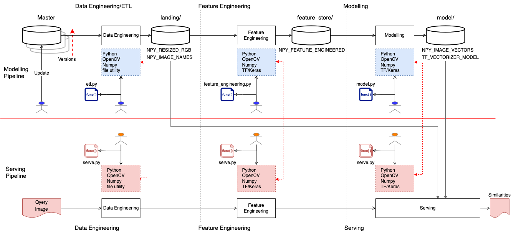
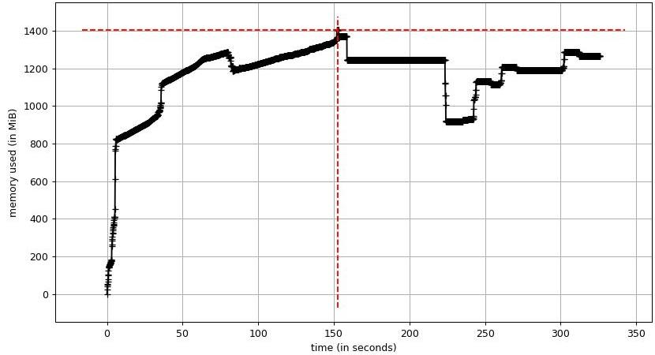
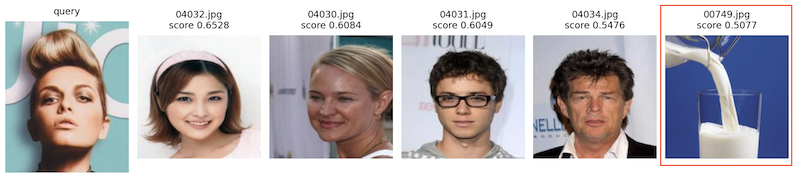

# Image Search Engine

## Objective

Implement a system to search similar images using the embedded image vector cosine similarity.

## Approach
**ResNet50** ```avg_pool``` layer, which is in front of the fully connected layer, outputs a vector of 2048 dimensions
for each input image of shape ```(height=224, width=224, channels=3)```. This vector represents the input image in the 
vector space, and the relative proximity among the vectors in the space is the similarity of the images. 
The proximity can be calculated by the cosine between normalized vectors.

Use Tensorflow Keras Model to create the model that embeds images into 2048 dimension vectors, 
and use it as the image **vectorizer**.

```
img2vec: Model = keras.Model(
    inputs=ResNet50.input,
    outputs=ResNet50.get_layer("avg_pool").output
)
```

## Function

The input to output function of the image search:

| Input                                                                                                                  | Output                                                                                                   |
|------------------------------------------------------------------------------------------------------------------------|----------------------------------------------------------------------------------------------------------|
| An query image to search similar ones. The image needs to have RGB channels and is in the format that OpenCV can load. | N number of similar images with their names and similarity scores, where the query image is on the left. |

**Example Output**


---
# Terminologies
* FE: Feature Engineering
* npy: numpy serialised file
* Artifacts: intermediate and final outputs from the modelling processes e.g. transformed image data, model for prediction, etc. 


| Artifacts              | Description                                                                                                                                                                                                                                          |
|------------------------|------------------------------------------------------------------------------------------------------------------------------------------------------------------------------------------------------------------------------------------------------|
| NPY_RESIZED_RGB        | Images data resized and transformed to have RGB channel order in memory. Serialized with numpy.save() method.  Each row in the array matches with the image name in NPY_IMAGE_NAMES.                                                                 |
| NPY_IMAGE_NAMES        | Name data of the resized RGB images. Each row in the array matches with the image in NPY_RESIZED_RGB. Serialized with numpy.save().                                                                                                                  |
| NPY_FEATURE_ENGINEERED | Images data preprocessed for the ResNet input layer.                                                                                                                                                                                                 |
| NPY_IMAGE_VECTORS      | Embedded image vectors data each of which represents a resized RGB image in the multidimensional latent space. The dimension size depends onthe vectorizer model, e.g. ResNet50 avg_pool layer output has 2048. Serialized with numpy.save() method. |
| TF_VECTORIZER_MODEL    | Vectorizer Keras Model instance used at modelling to vectorize the images into embedded image vectors.  Serialized with the Keras Model.save() method with the default options.                                                                      |

---
# Note

## Image Data Format
Need to use the same image format that TF/Keras ResNet50 has used for training its model. 
The shape is ```(height=224, width=224, channels=3)``` and the channel order is BGR.
However, TF/Keras provides the tool ```preprocess_input``` which takes RGB images and 
converts to BGR. Hence, the data we prepare at the feature engineering phase needs to be 
in RGB order.

Note the saved images in NPY_RESIZED_RGB have the RGB channel order. We use OpenCV that 
loads images into memory as BGR. The order is reverted to RGB and saved to NPY_RESIZED_RGB
with the order in disk.

When we run image search, we use a method ```most_similar(query=image)```. The image in memory 
passed to the method as its argument MUST be BGR order, so that the same transformations 
(resize, BGR to RGB, Keras/ResNet preprocess) will be applied.

## Training/Serving Skew
To prevent training/serving skew (drifts), need to use th same artifacts
fitted to data for transformations (e.g. scaling, mean-centering, PCA), and the consistent 
serialisation and de-serialisation methods.

The numeric data has been serialised using numpy ```save()``` and the Tensorflow Keras model artifacts have been 
serialised using Keras ```Model.save()``` with the default format and options.

## Image Order 

The row order in NPY_RESIZED_RGB and NPY_IMAGE_NAME is crucial to be able to 
correctly identify the `````(image data, image name)````` matching. The i-th row in NPY_IMAGE_NAMES 
needs to be the name of the image at the i-th row in NPY_RESIZED_RGB.

## ResNet Input Image

ResNet50 input image needs to have the shape of ```(height=224, width=224, channels=3)```.

---

# Standards

Follow the Python standards.

1. [PEP 8 – Style Guide for Python Code](https://peps.python.org/pep-0008/)
2. [Google Python Style Guide](https://google.github.io/styleguide/pyguide.html)
3. [Pylint](https://github.com/PyCQA/pylint)

---
# System Requirements

1. Python 3.9.x
2. pip 22.3.x
3. OpenCV 4.7
4. Numpy 1.24.x
5. Tensorflow 2.10.0
6. Tensorflow Keras Resnet50

### Development Environment
The environment used to develop and test.

```
MacOSX 13.0.1

$python --version
Python 3.9.13

$ pip --version
pip 22.3.1

$ pylint --version
pylint 2.15.6

$ pytest --version
pytest 7.2.0

>>> import cv2
>>> cv2.__version__
'4.7.0'

>>> import numpy as np
>>> np.__version__
'1.24.1'

>>>import tensorflow as tf
>>>print(tf.__version__)
2.10.0
```

---
# Structure

## Directory
Code is organized in the directory:

```
BASE
├── README.md
├── data
│   ├── master                            <--- Original image data                   
│   ├── landing                           <--- ETL output
│   │   ├── image_names.npy               <--- NPY_IMAGE_NAMES (to be created by ETL)
│   │   └── resized_rgb.npy               <--- NPY_RESIZED_RGB (to be created by ETL)
│   ├── feature_store                     <--- Feature engineering output
│   │   └── feature_engineered.npy        <--- NPY_FEATURE_ENGINEERED (to be created by FE)
│   └── model                             <--- Modelling output
│       ├── embedded_image_vectors.npy    <--- NPY_IMAGE_VECTORS   (to be created by modelling)
│       └── vectorizer_model              <--- TF_VECTORIZER_MODEL (to be created by modelling)
├── lib                                   <--- Set PYTHONPATH to here
│   ├── util_constant.py                  <--- Common constant
│   ├── util_file.py                      <--- Python file utility
│   ├── util_numpy.py                     <--- Numpy utility
│   ├── util_opencv
│   │   └── image.py                      <--- OpenCV image utility
│   └── util_tf
│       └── resnet50.py                   <--- TF/Keras Resnet utility
└── src
    ├── requiments.txt
    ├── pylintrc
    ├── etl.py                            <--- Resize image and convert to RGB
    ├── feature_engineering.py            <--- Feature engineering e.g. ResNet preprocessing
    ├── model.py                          <--- Vectorizer model and image vector generation
    ├── serve.py                          <--- Image search
    ├── function.py                       <--- Utility
    ├── _common.sh
    ├── run_modelling_pipeline.sh         <--- Run modeling pipeline
    └── run_serving_pipeline.sh           <--- Run image serach

```

## Code

Commonly used functions are placed under ```lib``` directory for reusability not to to repeat the same efforts.

### src/serving.py

#### ```ImageSearchEngine.most_similar```

The method in the class implements the image search based on the cosine similarities.

```
    def most_similar(
            self, query: np.ndarray, n: int = 5  # pylint: disable=invalid-name
    ) -> List[Tuple[float, str]]:
        """
        Return top n most similar images.
```

### src/model.py

#### ```Vectorizer.transform()``` 

The method in the class implements the image vectorization using the ResNet50 ```avg_pool``` layer output
to embed the images into a vector of the latent space of 2048 dimensions.

```
def transform(self, images: Sequence[np.ndarray]) -> Optional[np.ndarray]:
        """Transform list of images into numpy vectors of image features.
        Images should be preprocessed first (padding, resize, normalize,..).

        The results are embedded vectors each of which represents an image
        in a multidimensional space where proximity represents the similarity
        of the images.
```

### lib/util_numpy.py

#### ```get_cosine_similarity()```

The method implements the cosine similarity in the vectorized manner.

```
def get_cosine_similarity(x: numpy.ndarray, y: np.ndarray) -> np.ndarray:
    """Calculate cosine similarity
```

### lib/util_tf/resnet.py

#### ```ResNet50Helper```

The class implements the TF/Keras ResNet50 utility functions.

```
class ResNet50Helper:
    """TF Keras ResNet50 helper function implementations"""
```

### lib/util_opencv/image.py

The file implements the OpenCV utility functions.


---


# Execution

## Overview

There are two pipelines to: 
1. run modelling by going through ```Data Engineering/ETL->Feature Engineering->Modelling``` phases.
2. run serving to search images by going through ```Data Engineering->Feature Engineering->Serving``` phases.



### Modelling Pipeline

```Data Engineering/ETL``` phase resizes the images and converts to RGB in memory. 
It generates the artifacts below and save them in the landing zone.
* NPY_RESIZED_RGB
* NPY_IMAGE_NAMES

```Feature Engineering``` phase processes NPY_RESIZED_RGB to generate features 
that ResNet50 can take as its inputs. It generates the artifact below and save it 
in the feature store directory. 

* NPY_FEATURE_ENGINEERED

```Modelling``` phase processes NPY_FEATURE_ENGINEERED and uses KF/Keras ResNet Model ```avg_pool``` 
layer output to vectorize the images. It generates the artifacts below and saved them in the model directory.

* NPY_IMAGE_VECTORS
* TF_VECTORIZER_MODEL

### Serving Pipeline

The same transformations in ```Data Engineering``` and ```Feature Engineering``` in the modelling pipeline 
will be applied to the query image. Then the ```Serving``` phases searches the images.


## Setup

1. Place original images in ```data/master``` directory.
2. Create a Pyton virtual environment.
    ```
    python -m venv ${VENV_NAME}
    ```
3. Activate the viertual environment and install python packages.
    ```
    pip install -r src/requirements.txt
    ```
4. Set the PYTHONPATH environment variable to include the ```lib/``` directory.

## Commands


1. To run the modelling pipeline:
   ```
   $ cd src/
   $ ./run_modelling_pipeline.sh
   ```

2. To run the image search:
   ```
   $ cd src/
   $ ./run_serving_pipeline.sh
   There will be a command line message to provide the path to the query image. CTRL-C or CTRL-D to exit.
   ```

3. To run pytest:

   ```
   $ ./run_pytest.sh    # Currently only some files in lib/ are tested. 
   ```

---
# Profiling

## Memory Profiler

### Serving

Memory usages for running the serving pipeline have been profiled. The memory footprints are 
dominated by the model and image data. Searching similarities only requires 100 MB.

See [memory_profile_serving.log](./doc/memory_profile_serving.log) for full listing. 

#### Major memory usages of the serving.py for startup: 
1. **353** MB - The resized image data
2. **460** MB - The image search engine that loads the Keras ResNet (up to avg_pool layer) Model

```
Line #    Mem usage    Increment  Occurrences   Line Contents
=============================================================
   407                                             # 1. Load image vectors (NPY_IMAGE_VECTORS)
   411    443.2 MiB     31.5 MiB           1       image_vectors: np.ndarray = load(path_to_file=source_file_path)

   414                                             # 2. Load images (NPY_RESIZED_RGB)
   420    796.1 MiB    352.9 MiB           1       image_data: np.ndarray = load(path_to_file=image_data_file_path)
   
   423                                             # 3. Load image names (NPY_IMAGE_NAMES)
   427    785.0 MiB     -8.6 MiB           1       image_names: np.ndarray = load(path_to_file=image_name_file_path)
   
   436                                             # Start the search engine
   439   1244.6 MiB    459.6 MiB           2       engine: ImageSearchEngine = ImageSearchEngine(
```

#### Major memory usages of the serving.py for image search

1. **37** MB to vectorize the query image
2. **63** MB to search the similarities.

```
Line #    Mem usage    Increment  Occurrences   Line Contents
=============================================================
   268                                                 # Apply the same processing done at modelling pipeline
   270    956.2 MiB     37.4 MiB           1           vectorized: np.ndarray = self.transform(query=query)

   273                                                 # Take N most similar
   275   1019.2 MiB     63.1 MiB           2           similarities: np.ndarray = np.squeeze(self.cosine_similarity(
```

#### Memory Usage Timeline



---

# TODO

## Investigation on Mismatches

Need to investigate why some query images generate mismatches, e.g.:
* a face image query matches milk pouring to a glass.  


## PyTest

Need to cover the entire ```src/``` and ```lib/``` functions. The integration tests have not been designed yet.

## Code Performance Analysis

* [line_profiler and kernprof](https://github.com/pyutils/line_profiler)

## Algorithm

### Image Resize

Currently an image is resized to ```(height=224, width=224)``` without considering the shape of the image,
e.g. converting a rectangle image into a square image, hence causing distortions in the images.

### Models

Test other models other than ResNet50.

---

# References

* [Arxiv - Deep Residual Learning for Image Recognition](https://arxiv.org/abs/1512.03385v1)
* [Kerass ResNet and ResNetV2](https://keras.io/api/applications/resnet/#resnet50-function)
* [tf.keras.applications.resnet50.preprocess_input](https://www.tensorflow.org/api_docs/python/tf/keras/applications/resnet50/preprocess_input)
* [How should I standardize input when fine-tuning a CNN?](https://stats.stackexchange.com/questions/384484/how-should-i-standardize-input-when-fine-tuning-a-cnn/388461#388461)